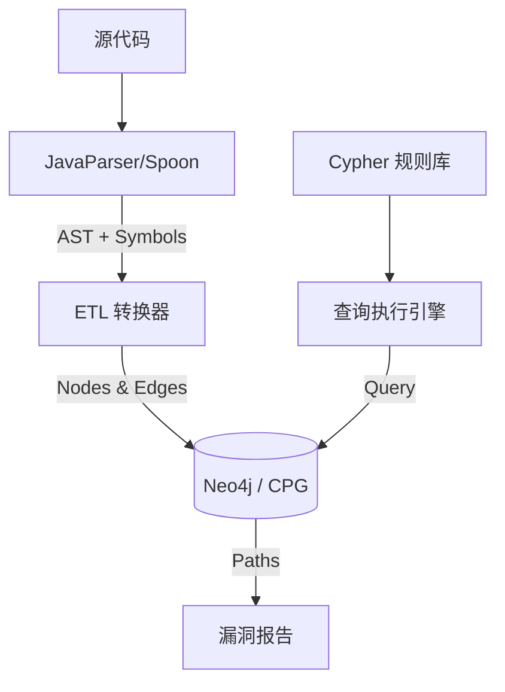

toolName: todo_write
            
status: success
          
Todos updated: 4 items
          

​            
toolName: view_files
​            
status: success
​          
​            
filePath: e:/chanzisast/app/ChanziSAST.cfg
​          

​            
toolName: search_codebase
​            
status: failed
​          
query: Find any files with .cypher, .yaml, or .xml extension that might contain security rules or configuration
​          

​            
toolName: file_search
​            
status: success
​          
file_pattern: **/*.cypher
​          

​            
toolName: file_search
​            
status: success
​          
file_pattern: **/*.{xml,yaml,yml}
​          

​            
toolName: view_folder
​            
status: success
​          
e:/chanzisast/app/
​          

​            
toolName: view_files
​            
status: success
​          
​            
filePath: e:/chanzisast/lsp/config_win/config.ini
​          

​            
toolName: todo_write
​            
status: success
​          
Todos updated: 4 items
​          
根据对当前工作区文件结构、配置文件 `ChanziSAST.cfg` 以及运行日志的深度分析，我为您整理了这份《技术架构分析报告》。

### 1. 技术栈推导 (Tech Stack Inference)

该工具是一个典型的 **Local-First**（本地优先）的桌面端代码审计应用，采用 Java 生态构建，核心依赖于 Eclipse JDT 进行代码解析，并内嵌 Neo4j 图数据库进行污点分析。

*   **开发语言**: **Java 21+**
    *   **证据**: `app/` 目录下存在大量的 `.jar` 文件。`javafx-base-24.0.2.jar` 等 JavaFX 24 组件表明其运行环境至少需要 JDK 17，很可能是 JDK 21（因为 JavaFX 24 较新）。
*   **GUI 框架**: **JavaFX**
    *   **证据**: 配置文件 `ChanziSAST.cfg` 中指定的主类为 `com.chanzi.ui.JavaFXBootStrap`。
    *   **组件**: 使用了 `atlantafx-base` (现代化 UI 主题), `richtextfx` (代码编辑器高亮), `reactfx` (响应式编程)。
*   **代码解析与索引 (LSP)**: **Eclipse JDT (Java Development Tools)**
    *   **证据**: `lsp/bin/jdtls` (Eclipse JDT Language Server 二进制), `app/org.eclipse.jdt.core-*.jar`。
    *   **作用**: 提供完整的 Java 语法解析、符号引用解析 (Type Hierarchy, Call Hierarchy)，这是实现准确污点分析的基础。
*   **图数据库**: **Neo4j Embedded (嵌入式)**
    *   **证据**: `app/` 目录下包含 `neo4j-kernel-*.jar`, `neo4j-dbms-*.jar` 等核心库，且无外部数据库连接配置。日志中提到的数据库路径 `.../Hello-Java-Sec_neo4j_...` 是典型的嵌入式数据存储目录。
    *   **版本**: **Neo4j 5.x** (从 `neo4j-kernel-2025.01.0.jar` 和 `neo4j-java-driver-5.27.0.jar` 推断)。
*   **查询引擎**: **Cypher**
    *   **证据**: `app/cypher-*.jar`，以及用户提供的 `.cypher` 规则样本。

### 2. 核心工作流复盘 (Workflow Reconstruction)

基于日志和文件指纹，该工具的内部工作流如下：

#### 阶段一：环境初始化与 LSP 启动
1.  **启动**: `ChanziSAST.exe` 读取 `ChanziSAST.cfg`，启动 JVM 并加载 JavaFX 界面。
2.  **LSP 握手**: 工具在后台启动 `lsp/bin/jdtls` 进程。
3.  **建立索引**: `jdtls` 扫描用户代码 (`E:\靶场代码\Hello-Java-Sec`)，建立内存中的符号索引。这对应日志中的 `代码索引创建成功`。这一步解决了"类A调用类B"的语义解析问题。

#### 阶段二：图谱构建 (ETL)

1.  **AST 遍历**: 工具的主程序 (`chanzi-*.jar`) 通过 LSP 协议或直接调用 JDT API 获取代码的 AST（抽象语法树）。
2.  **语义映射**: 此时进行关键的 **"语义增强"**。工具不仅仅是把 AST 存入数据库，而是会根据框架特征打标签。
    *   *推断*: 当解析器遇到 `@Controller` 注解时，它不仅创建一个 `Class` 节点，还会给该节点的入参创建 `SpringControllerArg` 标签（对应规则中的 `sourceNode:SpringControllerArg`）。
3.  **写入图库**: 使用 `neo4j-kernel` 的嵌入式 API (`GraphDatabaseService`) 将节点和关系写入 `C:\Users\...\Hello-Java-Sec_neo4j_...` 目录。

#### 阶段三：规则执行 (Taint Analysis)
1.  **加载规则**: 从内部资源（可能是 jar 包内的 XML/YAML/Cypher 文件）加载预定义的 Cypher 查询。
2.  **图查询**: 在嵌入的 Neo4j 实例上执行 Cypher 语句。
    *   `MATCH p = shortestPath((sourceNode)-[*..30]->(sinkNode))`
    *   这条语句利用 Neo4j 的图算法寻找从 **污点源 (Source)** 到 **危险函数 (Sink)** 的可达路径。
3.  **结果输出**: 将查询返回的 `path` 对象转换为可视化的漏洞报告。

### 3. 关键库/文件指纹 (Key Fingerprints)

| 文件/目录                        | 关键技术点       | 作用说明                                           |
| :------------------------------- | :--------------- | :------------------------------------------------- |
| `app/chanzi-2025.4.1-ob.jar`     | **核心逻辑**     | 包含 ETL 逻辑、规则库和 UI 胶水代码（已混淆）。    |
| `app/org.eclipse.jdt.core-*.jar` | **Parser**       | 业界最强的 Java 编译器前端之一，用于生成 AST。     |
| `app/neo4j-kernel-*.jar`         | **Graph DB**     | 嵌入式图数据库核心，无需安装独立 Server。          |
| `app/neo4j-cypher-*.jar`         | **Query Engine** | 解析和执行 Cypher 查询语言。                       |
| `lsp/bin/jdtls`                  | **LSP Server**   | Eclipse JDT 语言服务器，提供跨进程的代码分析能力。 |
| `app/javafx-controls-*.jar`      | **UI**           | 构建现代化的桌面客户端界面。                       |

### 4. 仿照开发建议 (Replication Guide)

如果您想从零开发一个类似的 **Java SAST 工具**，建议采用以下开源技术栈组合，可以达到类似甚至更好的效果：

#### A. 代码解析 (Parser)
*   **选项 1 (推荐): JavaParser** + **JavaSymbolSolver**
    *   *理由*: 比 Eclipse JDT 轻量，API 更友好，且自带符号求解器（Symbol Solver），能解决"变量定义在哪里"的问题。
*   **选项 2 (高级): Spoon**
    *   *理由*: 支持完整的 AST 分析和代码转换，学术界和工业界常用。
*   **选项 3 (多语言): Tree-sitter**
    *   *理由*: 速度极快，支持多种语言，但语义分析（Symbol Resolution）需要自己实现。

#### B. 核心数据库 (Database)
*   **选项 1 (推荐): Neo4j (Community Edition)**
    *   *理由*: 生态最成熟，Cypher 查询语言是图查询的事实标准。可以使用 `Neo4j-OGM` 或 `Spring Data Neo4j` 简化开发。
*   **选项 2: Code Property Graph (CPG) / Joern**
    *   *理由*: 直接使用 `ShiftLeftSecurity/joern` 的开源组件。它已经实现了把代码转换为 CPG 图（包含 AST、CFG、PDG）的逻辑，且自带 Scala 查询脚本，省去了自己写 ETL 的巨大工作量。

#### C. 污点分析算法
不要自己写图遍历算法，直接利用图数据库的能力：
1.  **定义 Source**: 编写查询查找所有 `HttpServletRequest.getParameter()` 或 Spring 的 `@RequestParam`。
2.  **定义 Sink**: 编写查询查找 `Runtime.exec()`, `Statement.executeQuery()`。
3.  **定义 Flow**: 利用 Neo4j 的 `shortestPath` 或 `apoc.path.expand` 查找两者之间的连接。

#### D. 架构设计图 (简版)

