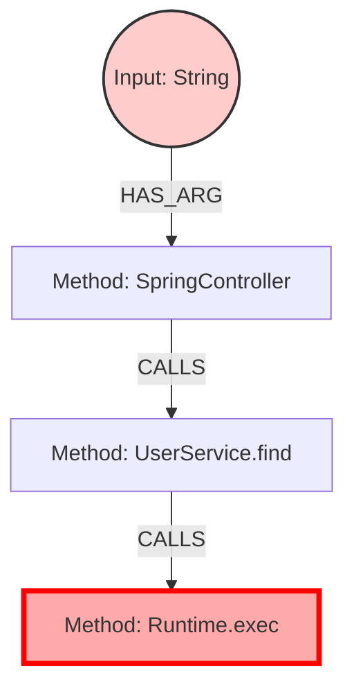

toolName: todo_write
            
status: success
          
Todos updated: 4 items
          

​            
toolName: view_files
​            
status: success
​          
​            
filePath: e:\chanzisast\Hello-Java-Sec_neo4j_20251211090724\logs\query.log
​          

​            
toolName: view_files
​            
status: success
​          
​            
filePath: e:\chanzisast\Hello-Java-Sec_neo4j_20251211090724\logs\debug.log
​          

​            
toolName: todo_write
​            
status: success
​          
Todos updated: 4 items
​          
这是一份基于数据取证和日志分析的《数据流与算法逻辑推断报告》。

### 1. 数据目录解剖 (Data Directory Forensics)

通过对生成工件（Artifacts）的分析，该工具采用了 **"三级存储架构"**，每种数据目录承担不同的职责：

| 目录名称              | 核心技术           | 职责推断                                                     | 关键证据                                                     |
| :-------------------- | :----------------- | :----------------------------------------------------------- | :----------------------------------------------------------- |
| **`..._lspdata_...`** | **Eclipse JDT LS** | **语义解析与符号索引**。 这是一个标准的 Eclipse Workspace，用于让 JDT 编译器后台运行，建立 Java 的类型层级（Type Hierarchy）和引用关系。它解决了“变量类型推断”和“跨文件调用”的难题。 | 目录结构包含 `.metadata/.plugins/org.eclipse.jdt.core` 和大量的 `.index` 文件。 |
| **`..._lucene_...`**  | **Apache Lucene**  | **全文检索与代码定位**。 用于存储源代码的文本内容和行号映射。当图数据库发现漏洞路径时，工具需要快速定位到具体的代码行（如 `UserMapper.xml:15`），Lucene 比数据库更适合做这种文本行级的快速查找。 | 包含 `_0.cfs` (Compound File Segment) 等 Lucene 标准索引文件。 |
| **`..._neo4j_...`**   | **Neo4j Embedded** | **代码属性图 (CPG) 存储**。 存储经过结构化处理的代码图谱（节点+关系）。所有的污点分析（Taint Analysis）都在这里通过图遍历算法完成。 | 包含 `neostore.nodestore.db` 等二进制存储文件；日志显示发生了约 4000 次事务提交 (`txId: 3999`)，证明是逐个节点写入而非批量导入。 |

### 2. 图模型 (Graph Model) 推测

虽然无法直接读取二进制的 Neo4j 数据文件，但结合你提供的 **Cypher 规则** 和常见的 SAST 架构，可以逆向重构出其 Schema 设计：

#### **节点 (Nodes)**
基于规则 `sourceNode:SpringControllerArg` 和 `sinkNode:ProcessBuilder`，节点被设计为 **"混合标签" (Multi-Label)** 模式：
*   **基础标签**:
    *   `Method`: 代表一个 Java 方法。
    *   `Class`: 代表一个 Java 类。
    *   `Arg` / `Variable`: 代表方法参数或局部变量。
*   **语义标签 (关键)**:
    *   工具在解析阶段就会根据框架特征打标，而不是在查询阶段判断。
    *   `SpringControllerArg`: 被识别为 Spring 控制器的入口参数（污点源）。
    *   `DubboServiceArg`: Dubbo RPC 接口参数。
    *   `Exec`: 执行命令的危险函数。

#### **关系 (Relationships)**
*   `(:Method)-[:CALLS]->(:Method)`: 函数调用关系（最核心的边）。
*   `(:Class)-[:HAS_METHOD]->(:Method)`: 类与方法的从属关系。
*   `(:Method)-[:HAS_ARG]->(:Arg)`: 方法与其参数的关系。
*   `(:Arg)-[:DATA_FLOW]->(:Arg)`: **推测**。如果工具支持数据流分析，它会计算变量赋值关系并建立此边；如果只是简单的调用链分析，可能仅依赖 `CALLS`。

#### **可视化图解**

### 3. 代码处理流水线 (Pipeline Reconstruction)

该工具采用了 **"解析-入库-查询"** 的标准 SAST 流水线。

**Phase 1: 预处理与编译 (Preprocessing)**
1.  **启动 LSP**: 启动 `jdtls` 进程，将目标目录 `E:\靶场代码\Hello-Java-Sec` 作为一个 Eclipse 项目导入到 `..._lspdata` 临时工作区。
2.  **构建索引**: JDT 分析所有 `.java` 文件，解析类路径（Classpath），确保能正确识别 `HttpServletRequest` 等第三方库类型。

**Phase 2: 图谱转换 (ETL)**
1.  **AST 遍历**: 主程序通过 LSP 接口或 JDT ASTParser 遍历每个文件的语法树。
2.  **特征提取与入库 (Embedded Neo4j)**:
    *   遇到类定义 -> 创建 `(:Class)` 节点。
    *   遇到方法调用 `A.b()` -> 创建 `(:Method A)-[:CALLS]->(:Method b)` 边。
    *   **关键步骤**: 检查注解（Annotation）。
        *   如果发现 `@RequestMapping`，立即给当前方法的参数节点打上 `:SpringControllerArg` 标签。这是一种**"写入时计算" (Compute on Write)** 的优化策略，大大简化了后续的查询逻辑。
3.  **文本索引**: 同时将文件路径和内容摘要写入 Lucene 索引，用于前端快速展示代码片段。

**Phase 3: 漏洞检测 (Detection)**
1.  **规则加载**: 读取预置的 Cypher 语句。
2.  **图算法执行**:
    *   Neo4j 引擎执行 `shortestPath((source)-[*..30]->(sink))`。
    *   由于 Source 节点在 Phase 2 已经被打好了标签（如 `:SpringControllerArg`），查询引擎无需重新扫描整个图，只需从这些特定节点开始遍历，效率极高。

### 4. 开发参考 (Developer Guide)

如果您要复刻这个工具，建议的数据存储设计如下：

1.  **不要用 CSV 导入**：
    *   日志显示的 4000+ 事务证明它是通过 Java API (`GraphDatabaseService.createNode()`) 实时写入的。这种方式虽然比 CSV 慢，但允许你在写入过程中动态判断逻辑（例如：看到 A 继承了 B，就自动把 B 的标签也打给 A）。
    *   **建议**: 使用 Neo4j Java Driver 或 Embedded API，在遍历 AST 的回调函数中直接写库。

2.  **Lucene 的必要性**：
    *   不要试图把源代码的大文本存入 Neo4j 的节点属性中，这会极大地拖慢图遍历速度。
    *   **最佳实践**: Neo4j 节点只存 `filePath` 和 `lineNumber`。需要显示代码时，利用 Lucene 或直接读取文件系统。

3.  **Schema 优化技巧**:
    *   **预计算标签**: 像这个工具一样，不要在查询时写 `WHERE n.annotation = 'Controller'`，而是在入库时直接给节点加 `:Controller` 标签。Neo4j 对标签索引有极致优化。