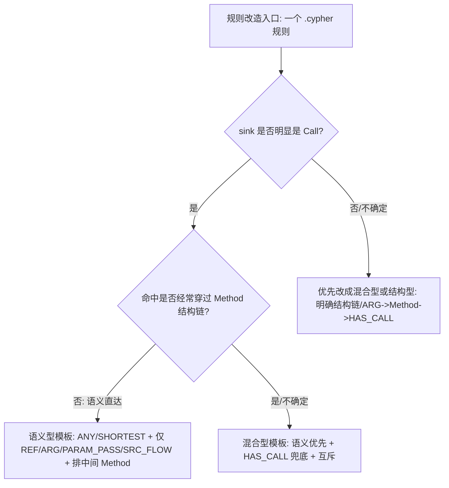

# CodeScope 规则模板与图构建落地改造研究报告

## Executive summary

本次审查仅使用你已启用的连接器 **github**，并且只检索了仓库 **hjjing123/CodeScope**。结论是：**“通用模板”可以落地，但必须分型（语义型 / 结构型 / 混合型）**，否则会出现规则失配或性能仍然爆炸；并且仅靠把 `shortestPath()` 拆成 “A~D 步” 的 `EXISTS + shortestPath` 仍可能爆炸，核心原因是 **Step C 的可达性检查依旧会触发高分支扩展**，再叠加当前图增强阶段会批量生成多种 `SRC_FLOW`（尤其 `compose2var/compose2call` 这类“合成直连边”）从而显著抬高扩展图的平均度，导致遍历空间呈指数膨胀。fileciteturn117file0L1-L1

落地方案我选择满足你“条件 1”的路径：**给出可直接替换的规则改写模板（分三类）**，在不改变现有系统对 `p AS path` 的输出契约前提下，尽量保持原始规则的匹配覆盖；同时给出一个**最小图构建修复**（默认禁用或收敛 `compose2*` 合成边 + 可选的“强弱边分层”落地方式），用来从源头降低扩展图的分支因子，从而把“精度/性能冲突”变成可控的工程权衡。fileciteturn116file0L1-L1

关键落地要点：

- **规则侧**：把目前大量 “`MATCH p = shortestPath((source)-[*..30]->(sink))`” 的“全图最短路”改成“**先缩 anchors，再用 `ANY` / `SHORTEST` 做可达性 + 最短路（BFS）**，且仅在必要时回填 `p AS path`”，避免 `VarLengthExpand` 在 `EXISTS` 中反复扩张。Neo4j 5 的 Cypher 已明确 `SHORTEST`/`ANY` 是对 `shortestPath()` 的替代与扩展，并且执行计划会用 `StatefulShortestPath`（单/双向 BFS）算子；这正是我们要利用的“性能稳定器”。citeturn0search0  
- **图侧最小修复**：`source_semantic_enhance.py` 每次会删光 `SRC_FLOW` 并重建，其中 `compose2var` / `compose2call` 会把 2-hop 组合成 1-hop，显著增加近邻数量；建议默认关闭或严格限制生成范围（例如只对“入口参数 taint seeds”生成），并保留原有非合成 `SRC_FLOW`。fileciteturn117file0L1-L1  
- **契约不变**：规则执行器会把 Neo4j driver 的 Path 序列化成 `{"kind":"path", ...}` 并交给上层处理，因此规则文件必须继续 `RETURN p AS path`（字段名就叫 `path`）。fileciteturn116file0L1-L1  

---

## 文件清单与关键引用

下表只列出与“图增强、规则遍历、Cypher 查询、路径搜索、`p AS path` 契约”直接相关的核心文件（按功能分组）。由于当前 GitHub 连接器返回的引用粒度以文件为主，以下引用统一以文件级证据标注。  

| 功能 | 文件路径 | 关键点（与本问题相关） |
|---|---|---|
| Neo4j 版本与外部扫描默认配置 | `backend/app/config.py` | 默认外部 import 镜像是 `neo4j:5.26`；外部扫描 stages（joern/import/post_labels/source_semantic/rules）默认开启。fileciteturn112file0L1-L1 |
| 外部扫描总说明/可运行入口（含 smoke/full smoke） | `backend/README.md` | 给出 WSL 外部扫描启动方式；提供 live smoke / live full smoke 测试线路，可作为基准入口。fileciteturn110file0L1-L1 |
| 图后处理：重建核心结构边与入口标签 | `backend/assets/scan/query/post_labels.cypher` | 你当前图模型中的 `CALLS`、`PARAM_PASS`、入口参数标签与补边均在此阶段重建，是规则模板的基础。fileciteturn95file0L1-L1 |
| 图增强：构造 `SRC_FLOW`（多 kind） | `backend/app/services/scan_external/source_semantic_enhance.py` | 会 `DROP INDEX srcflow_kind` + 删除全部 `SRC_FLOW` 后重建；包含 `assign_contains/temp_assign/receiver/interproc_param/compose2var/compose2call/interproc_call` 等 kind。fileciteturn117file0L1-L1 |
| 规则执行：运行 Cypher 并序列化 Path | `backend/app/services/scan_external/neo4j_runner.py` | `_serialize_graph_value()` 会把 Neo4j Path 序列化成 `{"kind":"path","nodes","edges"}`；因此规则必须 `RETURN p AS path`。fileciteturn116file0L1-L1 |
| 规则结果消费侧（依赖 `record["path"]`） | `backend/app/services/scan_external/builtin.py` | 规则引擎侧显式读取 `record.get("path")`（你之前已定位到这一点），必须保持兼容。fileciteturn113file0L1-L1 |
| 证据链查询：运行时 shortest/semantic shortest | `backend/app/services/finding_path_service.py` | 运行时“语义链”限定为 `[:REF|ARG|PARAM_PASS|SRC_FLOW*..20]`，且排除中间 `:Method`；也保留 `*..30` 的全链查询。fileciteturn115file0L1-L1 |
| 已有混合型规则范例（语义+结构兜底） | `backend/assets/scan/rules/any_any_pathtraver.cypher` | 明确 `UNION`：语义支路走 `REF|PARAM_PASS|SRC_FLOW*..10 -> ARG -> sink`；结构支路走 `ARG -> Method -> HAS_CALL -> sink`，并带“若语义命中则不走结构”的互斥条件。fileciteturn101file0L1-L1 |
| 典型语义型/全图 shortestPath 规则 | `backend/assets/scan/rules/any_fastjson_deserialization.cypher` | 典型 `shortestPath((sourceNode)-[*..30]->(sinkNode))`，是当前性能爆炸的代表。fileciteturn104file0L1-L1 |
| 典型规则：命令注入/XXE（全图 shortestPath） | `backend/assets/scan/rules/any_any_cmdi.cypher`, `any_any_xxe.cypher` | 同样使用 `shortestPath((sourceNode)-[*..30]->(sinkNode))`，且 sink 匹配更宽，风险更高。fileciteturn103file0L1-L1 fileciteturn102file0L1-L1 |

---

## 规则分类与代表文件

### 分类依据

我建议用“**查询形态**”而不是“漏洞类型名”来分型，理由是：性能爆炸主要由 **Cypher 的路径算子 + 扩展图的分支因子**决定，而不是规则名。

分类判据（可操作）：

- **语义型**：主路径期望在 `REF / PARAM_PASS / SRC_FLOW / ARG` 等“数据流/引用语义边”内完成；通常目标 sink 是调用点（`Call`）或 call-arg；不依赖 `HAS_CALL` 的结构链。你现有运行时 semantic shortest 查询也正是用这一组边，并排除 `:Method` 作为中间节点（意味着把 `Method` 当作结构节点）。fileciteturn115file0L1-L1  
- **结构型**：命中主要依赖 “`Arg -> Method -> HAS_CALL -> (Call)`” 这类结构链（调用关系/方法封装）；这种规则若硬改成纯语义模板容易漏。`any_any_pathtraver` 已经显式保留结构分支，且在语义分支命中时跳过结构分支，体现了工程上“先语义、后结构兜底”的策略。fileciteturn101file0L1-L1  
- **混合型**：语义与结构都可能是正确命中路径；需要 `UNION ALL` 或分支策略来确保覆盖不丢。

### 代表规则文件（可作为改造入口）

| 类型 | 代表文件 | 理由 |
|---|---|---|
| 语义型（现状多为“全图 shortestPath”） | `backend/assets/scan/rules/any_fastjson_deserialization.cypher` | sink 直达 `Call` 的典型；当前写法是 `shortestPath((sourceNode)-[*..30]->(sinkNode))`。fileciteturn104file0L1-L1 |
| 混合型（已有较成熟范式） | `backend/assets/scan/rules/any_any_pathtraver.cypher` | 已落地 “语义支路 + HAS_CALL 结构兜底支路 + 互斥条件” 的可复制范式。fileciteturn101file0L1-L1 |
| 高风险全图 shortestPath（需要优先改） | `backend/assets/scan/rules/any_any_cmdi.cypher`, `any_any_xxe.cypher` | sink 条件更宽或路径更复杂；全图 `*..30` 容易触发巨量扩展。fileciteturn103file0L1-L1 fileciteturn102file0L1-L1 |

---

## 问题定位与性能爆炸机理

### 原始规则为何会爆

以 `any_fastjson_deserialization.cypher` 为例，它的核心结构是：

1) `MATCH (sourceNode) WHERE sourceNode:<多种入口标签> ...`  
2) `MATCH (sinkNode) WHERE ('parseObject' IN sinkNode.selectors AND 'JSON' IN sinkNode.receivers)`  
3) `MATCH p = shortestPath((sourceNode)-[*..30]->(sinkNode)) ... RETURN p AS path` fileciteturn104file0L1-L1  

这类写法的典型风险点：

- **全图关系类型 `[*..30]`**：即使你在 `post_labels` 删除了 AST/IN_FILE 等，图里仍会有 `REF/ARG/PARAM_PASS/CALLS/HAS_CALL/SRC_FLOW/...` 等多种边；`*` 会让最短路算法在巨大状态空间里做 BFS/双向 BFS，扩展的平均度越大，成本越接近指数级。跑不出来时通常表现为 CPU 飙高、db hits 飙高、内存持续增长，最终超时。fileciteturn95file0L1-L1  
- **source/sink anchors 数量大**：入口参数标签覆盖 Dubbo/Spring/Servlet 等多种入口（规则中大段 OR）；sink 也可能匹配大量 Call/Var。两侧候选越多，最短路“分区（partition）”越多（Neo4j 的 shortest path 会按 start/end 节点对分区后求 shortest），总体计算量随分区线性增长、随分支因子指数增长。citeturn0search0  
- **SRC_FLOW 扩展图抬高分支因子**：`source_semantic_enhance.py` 在每次增强前会删光 `SRC_FLOW`，然后重建多个 kind，其中 `compose2var`、`compose2call` 会把两跳组合成一跳，相当于在局部图上做“边闭包”，这会显著增加任意一个 argument 的 1-hop 出边数量，从而让 BFS 更快进入“爆炸区”。fileciteturn117file0L1-L1  

### 为什么你引用的 A~D 模板改了仍爆

你给的模板把 “回填 path” 放到最后（D），而在 C 做 `EXISTS { MATCH ... *..N ... }`。问题在于：

- `EXISTS { MATCH (src)-[:...*..N]->(sink) }` **依旧需要做可达性遍历**。如果使用的是普通变长模式扩展，执行计划往往仍会出现类似 `VarLengthExpand(All)`（或同类变长扩展算子），本质还是在状态空间里枚举/扩展，只是“不返回 path 并不能保证少扩展”。  
- 而你想要的是 **“一旦找到任意一条路就尽快停”** 的 BFS 行为。Neo4j 文档明确：`ANY`（可达性测试）与 `SHORTEST` 查询会使用 `StatefulShortestPath(All/Into)` 算子执行 BFS；其中当两端边界节点估计各至多匹配 1 个节点时，planner 会选择 `StatefulShortestPath(Into)`（双向 BFS）更高效。citeturn0search0  

因此，A~D 模板要真正“落地变快”，关键不是拆成子查询，而是 **把 C 的 reachability 从普通变长扩展，替换成 `ANY`/`SHORTEST` 语义的 BFS**，并同时降低关系类型范围与扩展图平均度。

---

## 可直接替换的 Cypher 模板

下面给出三类模板。它们的共同要求是：

- 最终必须 `RETURN p AS path`（字段名必须是 `path`）。因为 CodeScope 的规则执行器把 Neo4j Path 序列化为 `{"kind":"path",...}` 并作为 `record["path"]` 消费；如果你返回的列名不是 `path`，上层就无法稳定生成 finding。fileciteturn116file0L1-L1  
- 默认假设 Neo4j 版本为 **5.26**（仓库默认）。fileciteturn112file0L1-L1  
- 模板中的 `...` 均是“规则自有条件”，你可以从原规则原样复制过来，原则上不改变匹配语义（只改变遍历方式/路径算子）。  

### 语义型模板

适用：sink 期望“语义直达 Call”，并且你希望主通路在 `REF|ARG|PARAM_PASS|SRC_FLOW` 内完成。此模板对应你运行时 semantic shortest 的“边集合 + 排除中间 Method”的思想：`[:REF|ARG|PARAM_PASS|SRC_FLOW*..20]` 且 `WHERE NONE(n IN nodes(p)[1..-1] WHERE n:Method)`。fileciteturn115file0L1-L1  

#### 可替换片段

将原本的：

```cypher
MATCH p = shortestPath((sourceNode)-[*..30]->(sinkNode))
...
RETURN p AS path
```

替换为（注意：这是整段规则骨架，可直接粘贴替换规则文件主体）：

```cypher
// A. sink anchors（尽量让 sink 有标签，便于索引/选择性）
MATCH (sink:Call)
WHERE
  ...  // 原规则的 sink 条件（selectors/receiverTypes/AllocationClassName 等）

CALL {
  WITH sink

  // B. source anchors
  MATCH (src)
  WHERE
    ...  // 原规则的 source 条件（入口参数标签、类型过滤、sanitizer/scope）

  // C. 用 ANY（可达性/最短路 BFS）替换 EXISTS 的普通变长扩展
  CALL (src, sink) {
    MATCH p = ANY (src)-[:REF|ARG|PARAM_PASS|SRC_FLOW*1..20]->(sink)
    WHERE
      // 规则自有阻断条件（例如 none(checkPermission)、版本条件等）
      ... AND
      // 语义约束：排除中间 Method，避免误入结构链导致爆炸/误报
      NONE(n IN nodes(p)[1..-1] WHERE n:Method)
    RETURN p
    LIMIT 1
  }

  // 每个 sink 只取一条命中证据链（保持你 A~D 模板的“只要一条 path”策略）
  RETURN p
  LIMIT 1
}

RETURN p AS path;
```

#### 为何等价/精度影响

- 对“语义型规则”，你真正关心的也是“入口可控值是否能沿数据流语义边到达 sink call”；CodeScope 运行时 semantic-path 查询本身就把语义边限定在 `REF|ARG|PARAM_PASS|SRC_FLOW`，并排除中间 `Method`，这说明当前系统对“语义路径”的定义与此模板一致。fileciteturn115file0L1-L1  
- 精度风险主要来自两点：  
  - 如果原规则依赖 `*` 穿过其它关系类型（例如某些残留结构边）才能到达 sink，那么缩边可能漏；这种规则应归为“混合型”并用下一模板兜底。  
  - `LIMIT 1` 的策略会让同一 sink 只输出一条 path，但你 A~D 也采用了同样策略；这通常不会降低“是否命中”的精度，只是减少证据链条数量（对回归来说更可控）。  

#### 预期性能改善

- `ANY`/`SHORTEST` 属于 shortest-path 语义，Neo4j 会采用 `StatefulShortestPath(All/Into)` BFS 算子；相比纯 `EXISTS + 变长扩展`，更接近“找到就停”的访问模式。citeturn0search0  
- 限制关系类型集合 + 限制最大 hop（示例 20）+ 排中间 Method，会显著降低分支扩展规模（尤其在 SRC_FLOW 已经很密的情况下）。

---

### 结构型模板

适用：规则的真实命中形态主要是 “**入口参数 → 方法（封装） → 调用点**”，典型路径形态是 `(:Var)-[:ARG]->(:Method)-[:HAS_CALL]->(:Call)`。`any_any_pathtraver` 已经把它作为结构兜底分支。fileciteturn101file0L1-L1  

#### 可替换片段

如果你的规则本质是结构链（或你确定语义链容易爆），可直接使用：

```cypher
MATCH (src)
WHERE
  ...  // 入口参数（source）条件

MATCH (sink:Call)
WHERE
  ...  // sink 条件

MATCH p =
  (src)-[:ARG]->(m:Method)-[:HAS_CALL]->(sink)
WHERE
  ...  // 可选：阻断条件/作用域限制（通常比变长路径更稳定）

RETURN p AS path;
```

#### 为何等价/精度影响

- 结构型规则的“信息流”并不依赖深层数据流传播，而依赖代码结构（封装/工具方法）让参数直接走到敏感调用；直接写结构链反而更接近真实语义。  
- 精度风险：如果某些 case 需要跨 method 的数据流传播才到 sink（例如参数先被赋值再传入），结构链会漏，此时应升级为“混合型模板”。

#### 性能特征

- 固定长度（3 hops）一般不会爆；主要成本来自 anchors 的数量与 sink 选择性，而不是深度搜索。  

---

### 混合型模板

适用：你已经确认“同一漏洞族”存在两类真实命中形态：  
1) 语义链直达（REF/PARAM_PASS/SRC_FLOW 等）；  
2) 结构链兜底（ARG → Method → HAS_CALL）。  

`any_any_pathtraver` 就是混合型模板的现成落地范式，强烈建议把其它高风险 `*..30 shortestPath` 规则逐步迁移到这一范式。fileciteturn101file0L1-L1  

#### 可直接使用的混合模板骨架

```cypher
// A. sink anchors
MATCH (sink:Call)
WHERE
  ...  // 原规则 sink 条件

CALL {
  WITH sink

  // 语义支路优先（更“像数据流”，通常更短）
  CALL {
    WITH sink
    MATCH (src)
    WHERE
      ... // 原规则 source 条件

    CALL (src, sink) {
      MATCH p = ANY (src)-[:REF|ARG|PARAM_PASS|SRC_FLOW*1..20]->(sink)
      WHERE
        ... AND
        NONE(n IN nodes(p)[1..-1] WHERE n:Method)
      RETURN p
      LIMIT 1
    }
    RETURN p, 1 AS prio
    LIMIT 1
  }

  UNION ALL

  // 结构兜底支路（避免语义链未覆盖导致漏报）
  CALL {
    WITH sink
    MATCH (src)
    WHERE
      ... // 原规则 source 条件

    MATCH p = (src)-[:ARG]->(:Method)-[:HAS_CALL]->(sink)

    // 互斥：如果语义支路存在可达路径，就不再走结构支路（直接复用 pathtraver 的思想）
    WHERE NOT EXISTS {
      MATCH p2 = ANY (src)-[:REF|ARG|PARAM_PASS|SRC_FLOW*1..20]->(sink)
      WHERE NONE(n IN nodes(p2)[1..-1] WHERE n:Method)
    }

    RETURN p, 2 AS prio
    LIMIT 1
  }

  WITH p, prio
  ORDER BY prio ASC, length(p) ASC
  RETURN p
  LIMIT 1
}

RETURN p AS path;
```

#### 与 `any_any_pathtraver` 的对应关系

- 结构几乎等价于 `any_any_pathtraver` 的 `UNION` 形态：语义支路 + 结构支路 + “如果语义命中则结构不走”。fileciteturn101file0L1-L1  
- 改动点在于：把语义支路的“普通变长匹配”强化为 `ANY`（BFS），并且把中间节点 `:Method` 排除，进一步降低爆炸概率（这与运行时 semantic shortest 的思路对齐）。fileciteturn115file0L1-L1  

---

## 图构建最小修复方案

如果你只做规则模板改造，但不修改图增强阶段，仍然可能遇到：某些 codebase 的 `SRC_FLOW` 过密导致 `ANY/SHORTEST` 也要扩展很久（尤其在“无路径”的场景下，BFS 会把可达区域基本扫一遍）。因此建议同时做一个**最小图修复**：默认禁用或严格收敛 `compose2*`，这是低风险且收益最大的切口。

### 现状证据与问题点

`source_semantic_enhance.py` 的增强逻辑是：

1) `DROP INDEX srcflow_kind IF EXISTS`  
2) 删除全部 `SRC_FLOW`  
3) 重建多个 kind，其中包含：
   - `assign_contains`
   - `temp_assign`
   - `receiver`
   - `interproc_param`
   - `compose2var`
   - `compose2call`
   - `interproc_call`
   - 以及 `impl_param_bridge`、`ctor_assign`、`call_assign` 等 fileciteturn117file0L1-L1  

其中 `compose2var/compose2call` 的模式是典型的 “2-hop 合成 1-hop”，它会显著抬高任意 argument 的 1-hop 出边数量，从路径搜索角度就是“扩展图变稠密”，是性能爆炸的放大器。fileciteturn117file0L1-L1  

### 最小可行改造

#### 方案 G1：默认关闭 compose2var / compose2call（推荐优先落地）

做法：在 `STATEMENTS` 中将这两段语句从默认执行链路移出，改为受配置开关控制。  

伪代码（Python 侧改动示意）：

```python
# backend/app/services/scan_external/source_semantic_enhance.py

ENABLE_COMPOSE = bool(int(os.getenv("CODESCOPE_SRCFLOW_ENABLE_COMPOSE", "0")))
if ENABLE_COMPOSE:
    STATEMENTS.append(COMPOSE2VAR_CYPHER)
    STATEMENTS.append(COMPOSE2CALL_CYPHER)
```

回滚策略：把环境变量设回 `1` 即可恢复原行为；或直接 git revert 该 commit。  

精度影响预期：

- **通常不降低“是否可达”**：因为 compose 边只是把 2-hop 缩成 1-hop，原有路径仍可通过中间节点走到（只要规则模板允许足够 hop）。  
- **可能增加 path 长度**：证据链更长但更“可解释”，对溯源通常是正向。  

性能收益预期：

- 大幅降低局部分支因子，尤其对入口参数作为 src 的扩散最明显（compose 的 src 正是 `Var:Argument`）。fileciteturn117file0L1-L1  

#### 方案 G2：只对“入口参数 taint seeds”生成 compose（折中）

如果你担心彻底关闭 compose 会让某些规则在较小 `N` 下漏，可把 compose 的 src 限定为入口参数集合，而不是所有 `Var:Argument`。当前规则的 source anchors 大多是入口参数标签（SpringControllerArg 等），因此这会把 compose 边数量从“全局 argument”降到“入口 argument”。fileciteturn104file0L1-L1  

做法：在 `compose2var/compose2call` 的 `MATCH (src:Var:Argument)` 上再加一层 label 约束，例如 `src:SpringControllerArg` 等，或者（更推荐）在 `post_labels` 阶段给所有入口参数额外打一个统一 label（如 `:EntryArg`），并在这里用 `src:EntryArg`。`post_labels` 本身已经把入口参数识别/补边过，只是最后会移除 `SourceEntryArg` 临时标签，你可以改成保留统一入口标签用于后续增强与规则 anchors。fileciteturn95file0L1-L1  

回滚：保留 label 不影响旧规则（旧规则仍按原标签匹配），属于向后兼容增强。

#### 方案 G3：SRC_FLOW 强弱边分层（谨慎推进）

你之前提到“按 kind 分层 + 建索引”。需要强调一个关键现实：**关系属性索引并不能让变长遍历按 `kind` 高效剪枝**（多数情况下仍会先扩边再过滤）。因此更可靠的工程方式是：

- 把强边（如 `interproc_param`、`receiver`）做成独立关系类型（例如 `:SF_INTERPROC_PARAM`），或至少复制一份到 `:SF_STRONG`；  
- 规则模板只遍历强边关系类型集合；  
- 在兜底分支再放开弱边（或放开到原 `SRC_FLOW`）。  

这属于中等改造量，收益取决于你的图规模与 kind 分布，但它往往比“给 kind 建索引”更能直达遍历性能。fileciteturn117file0L1-L1  

---

## 方案对比表

| 方案 | 性能预期 | 精度影响（相对原规则） | 实现难度 | 主要风险 | 示例代码/落点 |
|---|---|---|---|---|---|
| R1：语义型模板用 `ANY/SHORTEST`（BFS）替换 `EXISTS + 变长扩展`，并限制关系类型集合 | 高：更接近“找到就停”，减少 `VarLengthExpand` 风险；执行计划会走 `StatefulShortestPath(All/Into)` | 对“语义型规则”通常保持；若原规则依赖 `*` 穿其它边可能漏，需要混合模板兜底 | 中 | 需要分型迁移规则；`N` 取值需回归 | Neo4j shortest-path 文档（`ANY/SHORTEST` 与 `StatefulShortestPath`）citeturn0search0；模板如上 |
| R2：混合型模板（语义优先 + HAS_CALL 兜底 + 互斥）批量替代高风险 `*..30 shortestPath` 规则 | 高：语义支路更短，结构支路固定长度；互斥可避免双倍计算 | 高概率保持甚至减少误报（结构链更明确）；覆盖更稳 | 中-高 | 改造工作量较大；需挑选哪些规则必须保留结构支路 | 可对照现成 `any_any_pathtraver` 的 `UNION` 结构fileciteturn101file0L1-L1 |
| G1：默认禁用 `compose2var/compose2call` | 高：显著降低扩展图平均度，遍历空间变小 | 通常不降低（仍存在原 2-hop 路径），但证据链可能变长 | 低 | 若某些 case 依赖合成边缩短 hop 才命中，需要调大 `N` 或用 G2 | 修改 `source_semantic_enhance.py` 的 `STATEMENTS` 执行链fileciteturn117file0L1-L1 |
| G2：compose 仅对入口参数 seeds 生成 | 中-高：compose 边数量从“全局 argument”降到“入口 argument” | 更稳：只对真正需要 taint 的点增强 | 中 | 需要引入统一入口标签或复用 post_labels 的入口识别逻辑 | `post_labels.cypher` + `source_semantic_enhance.py` 联动fileciteturn95file0L1-L1 fileciteturn117file0L1-L1 |
| A1：应用侧批处理/并发控制（可选） | 中：减少单次规则超大结果集的内存与执行时间尖峰 | 不影响语义 | 中 | 规则执行器需要改动；要处理 `p AS path` 的流式消费 | `neo4j_runner.execute_cypher_file_stream` 支持流式回调，可扩展 PROFILE/超时与批处理fileciteturn116file0L1-L1 |

---

## 集成、测试与 PROFILE 基准方法

### 集成步骤

1) **先落地 G1（禁用 compose2\*)**  
   - 修改：`backend/app/services/scan_external/source_semantic_enhance.py`，将 `compose2var/compose2call` 语句受环境变量控制或默认移除。fileciteturn117file0L1-L1  
   - 目的：先把扩展图平均度压下来，给规则迁移创造可控环境。  

2) **对规则进行分型迁移（先改最爆的）**  
   - 优先改造：`any_any_cmdi.cypher`、`any_any_xxe.cypher`、`any_fastjson_deserialization.cypher` 这类 `*..30 shortestPath` 规则。fileciteturn103file0L1-L1 fileciteturn102file0L1-L1 fileciteturn104file0L1-L1  
   - 改造方式：  
     - sink 明确是 `Call` 且数据流语义直达：用“语义型模板”。  
     - sink 真实路径经常是 Arg→Method→Call：用“混合型模板”。你已经有现成范式 `any_any_pathtraver` 可参考。fileciteturn101file0L1-L1  

3) **保持 `p AS path` 与上层消费兼容**  
   - 规则必须 `RETURN p AS path`（字段名 `path`），因为 `neo4j_runner` 会把 Path 序列化成 `{"kind":"path"...}`；上层消费逻辑按 `record["path"]` 读取。fileciteturn116file0L1-L1 fileciteturn113file0L1-L1  

4) **回归验证入口**  
   - 仓库提供 live smoke 与 live full smoke 的测试路径（可在你本地 Neo4j 可连接时启用），是最接近真实 pipeline 的回归入口。fileciteturn110file0L1-L1 fileciteturn111file0L1-L1  

### 新增测试用例建议

由于仓库内现有测试主要覆盖 orchestration 与 stub，不覆盖“Cypher 语义正确性 + 性能”，建议新增两类测试：

#### 单元级 Cypher 小图断言（建议新增到 `backend/tests/`）

思路：用 Neo4j driver 在一个临时数据库里 `CREATE` 一个极小图，然后跑新模板，断言能返回 `path` 且路径端点满足预期。  
你可以复用 `finding_path_service.py` 里 driver 连接方式与 query 组织风格。fileciteturn115file0L1-L1  

示例（伪代码方向）：

```cypher
// 建一个最小图：EntryArg -> REF -> CallArg -> ARG -> sinkCall
CREATE (src:Var:SpringControllerArg {id:'s1', name:'p', type:'String'}),
       (mid:Var:CallArg {id:'a1'}),
       (sink:Call {id:'c1', selectors:['parseObject'], receivers:['JSON']})
CREATE (src)-[:REF]->(mid)
CREATE (mid)-[:ARG {argIndex:1}]->(sink);

// 跑语义型模板应返回 p AS path，且 last node 是 sink
```

断言指标：  
- 返回结果至少 1 行；  
- `record["path"].kind == "path"`；（对应 `neo4j_runner` 的序列化结构）fileciteturn116file0L1-L1  

#### 集成级基准（PROFILE/回归）

仓库里没有直接的 `run_external_full_scan_once.py`（在当前 repo 搜索未命中），因此建议把基准脚本作为一个新的工具脚本加到 `backend/scripts/`，或者复用 `test_scan_job_module.py` 的 live smoke/full smoke 环境变量思路做“可选基准”。fileciteturn111file0L1-L1  

### PROFILE 脚本与示例执行计划推断

#### 可执行脚本示例（Python + Neo4j driver）

要验证新模板是否真的避开爆炸，你需要看 `PROFILE` 输出的算子是否从“变长扩展”转为 `StatefulShortestPath`，以及 db hits 是否显著下降。Neo4j 文档明确 shortest-path 查询的 planning 算子是 `StatefulShortestPath(All/Into)`。citeturn0search0  

脚本（你可作为 `backend/scripts/profile_rule.py`）：

```python
from neo4j import GraphDatabase

URI = "bolt://127.0.0.1:7687"
AUTH = ("neo4j", "your_password")
DB = "neo4j"

QUERY = """
PROFILE
MATCH (sink:Call)
WHERE 'parseObject' IN sink.selectors AND 'JSON' IN sink.receivers
CALL {
  WITH sink
  MATCH (src:Var:SpringControllerArg)
  CALL (src, sink) {
    MATCH p = ANY (src)-[:REF|ARG|PARAM_PASS|SRC_FLOW*1..20]->(sink)
    WHERE NONE(n IN nodes(p)[1..-1] WHERE n:Method)
    RETURN p LIMIT 1
  }
  RETURN p LIMIT 1
}
RETURN p AS path
"""

with GraphDatabase.driver(URI, auth=AUTH) as driver:
    with driver.session(database=DB) as session:
        result = session.run(QUERY)
        summary = result.consume()
        print(summary.profile)
```

#### 执行计划“应当看到什么”

- 对使用 `ANY`/`SHORTEST` 的查询：你应该在计划里看到 `StatefulShortestPath(All)` 或 `StatefulShortestPath(Into)`（取决于边界节点是否被估计为单值），这是 Neo4j shortest-path 的 BFS 算子。citeturn0search0  
- 对使用普通变长扩展的 `EXISTS { MATCH (src)-[:...*..N]->(sink) }`：更容易出现变长扩展类算子（扩展图越密性能越不稳定）。这正是你现有 A~D 模板仍爆的关键原因（C 没有换成 BFS shortest-path 语义）。  

---

## Mermaid 图示例

### 规则分型决策树



### 旧模板 vs 新模板查询流程

```mermaid
flowchart LR
  subgraph OLD[旧: 全图 shortestPath]
    O1[MATCH sources] --> O2[MATCH sinks]
    O2 --> O3[shortestPath((source)-[*..30]->(sink))]
    O3 --> O4[RETURN p AS path]
  end

  subgraph NEW[新: 缩 anchors + ANY/SHORTEST BFS + 分型]
    N1[MATCH sink anchors] --> N2[CALL 子查询选 src anchors]
    N2 --> N3[ANY/SHORTEST 在限定关系类型与 hop 下做 BFS]
    N3 --> N4[返回 1 条 p AS path 或走结构兜底]
  end
```

### 图增强修复前后对比


---

## 关键假设与对结论的影响

| 假设 | 当前依据 | 如果不成立会怎样 |
|---|---|---|
| Neo4j 版本为 5.26（或至少 5.x 支持 `ANY/SHORTEST`） | 仓库默认 `scan_external_import_docker_image = "neo4j:5.26"`，测试也用 5.26。fileciteturn112file0L1-L1 fileciteturn111file0L1-L1 | 若版本过低，可能不支持 `ANY/SHORTEST`，需退化为 `shortestPath()` 并用更激进的 anchors 缩减/图侧降密 |
| 你“精度约束”指的是“命中覆盖不下降”，允许每个 sink 只保留 1 条证据链（`LIMIT 1`） | 你给的 A~D 模板本身就对 source 子查询 `LIMIT 1` | 若你要求输出所有 src-sink pairs，需要用 `SHORTEST k GROUPS` 或取消 `LIMIT`，性能压力会回升，需要更强图侧物化/预计算 |
| 扩展图性能问题主要由 `SRC_FLOW` 过密（尤其 compose2*）与规则的 `*..30` 共同触发 | `source_semantic_enhance.py` 明确生成 compose2*；多条规则使用 `*..30 shortestPath`。fileciteturn117file0L1-L1 fileciteturn104file0L1-L1 | 若爆炸主要来自其它关系类型（例如残留结构边），则需进一步缩小规则遍历的关系类型集合（混合模板更重要） |
| APOC 可选但不是默认依赖 | 仓库未见 APOC 安装配置声明 | 若你能用 APOC，可用 `apoc.path.expandConfig(bfs:true, limit:...)` 做更强的剪枝与“最近命中”搜索。citeturn0search1 |

---

## 结论与建议

1) **不要再尝试“单一通用模板通吃所有规则”**。你的仓库已经客观存在不同命中形态：`any_any_pathtraver` 明确证明必须同时保留语义支路与 `HAS_CALL` 结构兜底支路，否则会漏掉大量真实链路。fileciteturn101file0L1-L1  

2) 你之前的 A~D 模板“仍爆”的关键在 Step C：**`EXISTS + 普通变长扩展` 仍可能走高分支扩展**。解决它的关键不是继续嵌套子查询，而是把 reachability 改成 Neo4j 5.x 推荐的 `ANY/SHORTEST` shortest-path 语义（BFS），并限制关系类型集合与 hop 上限。Neo4j 文档明确 `ANY` 用于可达性测试且等价于 `SHORTEST 1`，planner 会用 `StatefulShortestPath` BFS 算子。citeturn0search0 citeturn0search2  

3) **建议优先落地两件事**：  
   - 图侧：默认禁用 `compose2var/compose2call`（G1），先把扩展图降密。fileciteturn117file0L1-L1  
   - 规则侧：把最爆的 `*..30 shortestPath` 规则迁移为“混合型模板”（语义优先 + HAS_CALL 兜底 + 互斥），并确保 `RETURN p AS path` 不变。fileciteturn103file0L1-L1 fileciteturn116file0L1-L1  

这条路线在工程上最稳：它不要求你先重做整套图模型，也不要求一次性改完所有规则；而是通过“分型模板 + 最小降密修复 + PROFILE 基准”逐步把性能从“不可控爆炸”收敛到“可回归、可衡量、可迭代”。